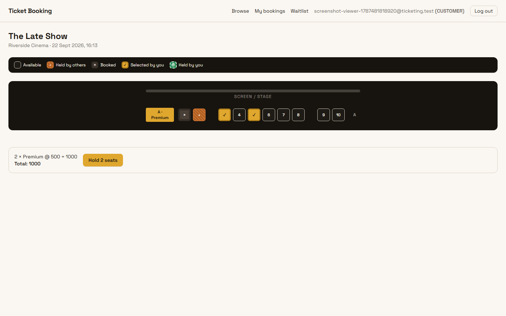
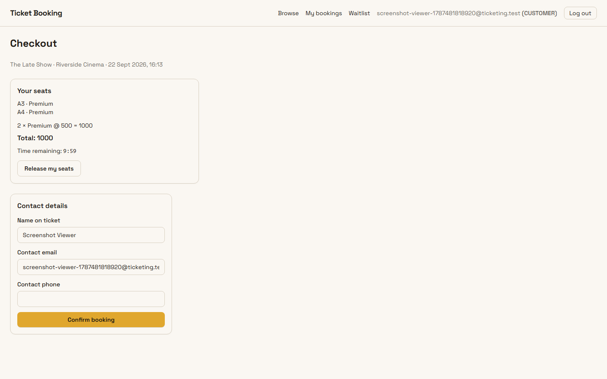
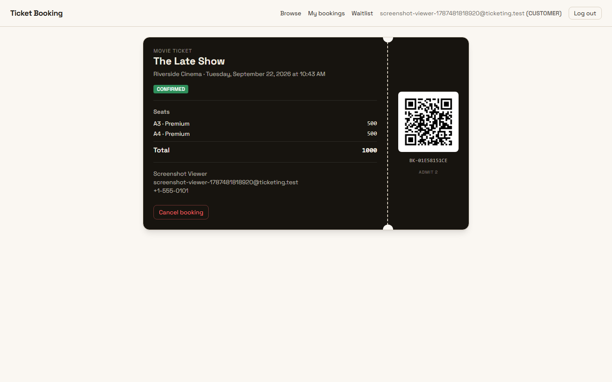
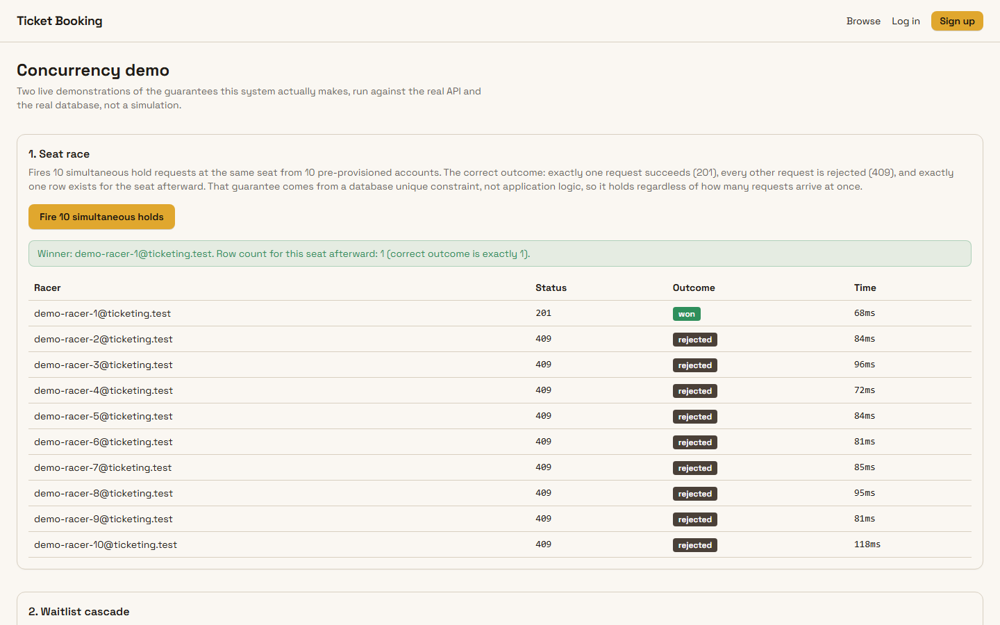
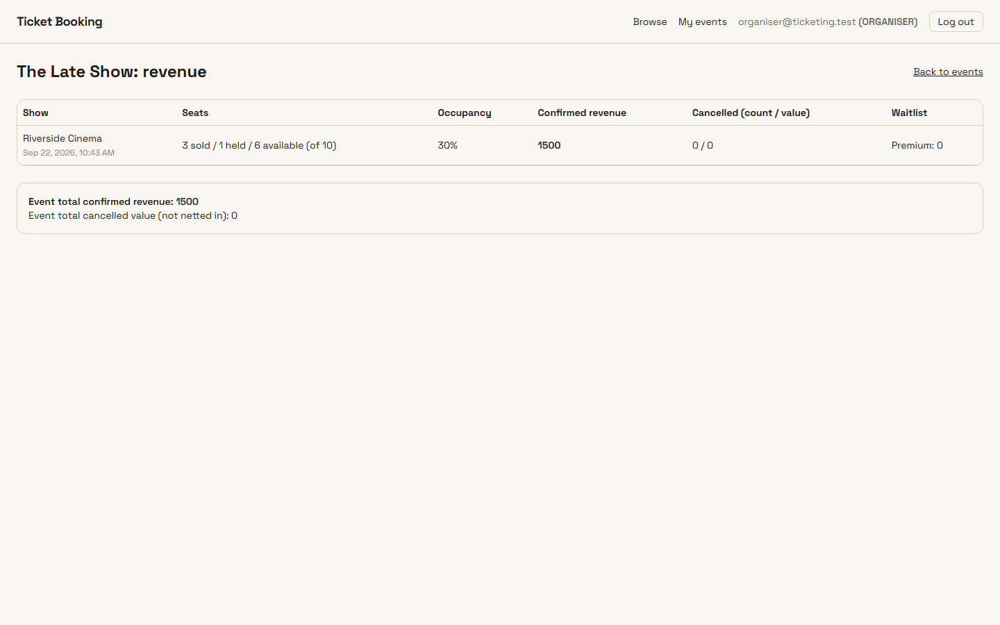
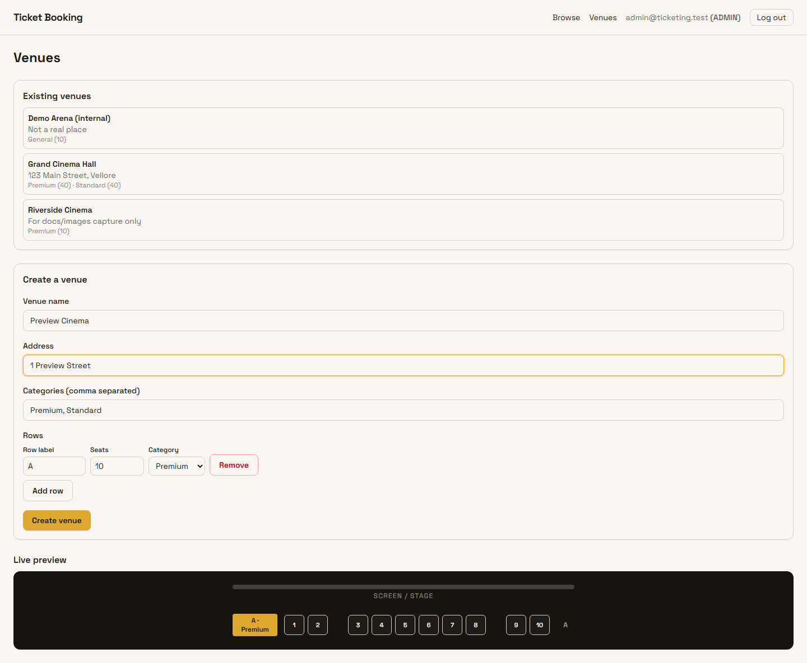
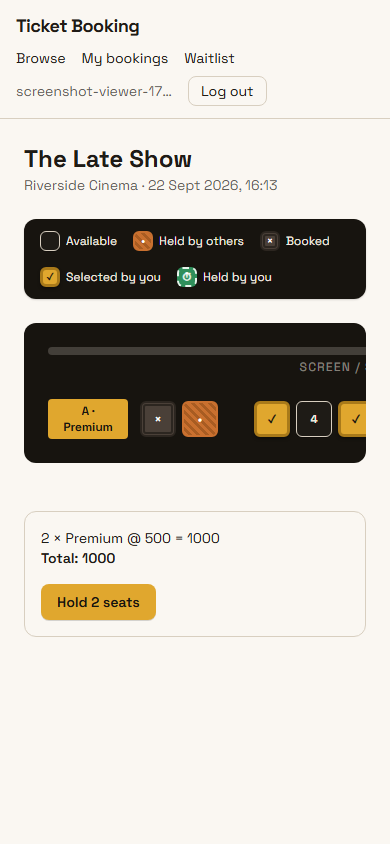

# Ticket Booking Platform

A movies-and-concerts ticket booking platform with real seat-level concurrency: two customers racing for the same seat get one winner and one honest, specific rejection, not a double-booked seat.

**Live: [unthinkable-two.vercel.app](https://unthinkable-two.vercel.app)**



## Try it now

No setup required — the live URL above is a real deployment against a real (Neon free-tier) database. Register your own account, or use a seeded one:

| Role | Email | Password |
|---|---|---|
| Admin | `admin@ticketing.test` | `AdminPass123!` |
| Organiser | `organiser@ticketing.test` | `OrganiserPass123!` |
| Customer | `alice@ticketing.test` | `CustomerPass123!` |

Three places worth going first:

- **[Book a seat](https://unthinkable-two.vercel.app/events)** — browse, pick a show, hold seats, check out. The hold has a visible countdown; released seats reappear for other customers within 3 seconds.
- **[A sold-out show](https://unthinkable-two.vercel.app/events/cmt4o4ezv004rltnkypacat2t)** — click through to the sold-out showtime and join its waitlist. Cancel a booking on that show (as any logged-in customer who holds one, or via the organiser view) to watch the offer cascade to the next person in line.
- **[/demo](https://unthinkable-two.vercel.app/demo)** — fires ten simultaneous hold requests at one seat and shows the single winner, and separately triggers the waitlist cascade on cancellation, both against the real API and real database, no cloning required.

The database can take a few seconds to wake up on the very first request after a quiet period — see [Known limitations](#known-limitations).

**Test coverage**: seven scripts, 167 assertions, run with a single `npm run test:all` — see [Testing](#testing).

## Screenshots

| | |
|---|---|
|  Checkout, with the live hold countdown |  A confirmed booking's ticket, QR included |
|  `/demo` mid-race: ten simultaneous holds, one winner |  Organiser revenue and occupancy |
|  Admin venue layout builder, live preview populated |  The seat map at 390px — the seat grid scrolls in its own box, the page doesn't |

Shot list and file names: [`docs/images/README.md`](docs/images/README.md). Screenshots are generated by `scripts/screenshots.ts` (a temporary local Playwright install, driving the production URL — see that file's header comment) and re-captured whenever the app changes enough to make them stale.

## Contents

- [Try it now](#try-it-now)
- [Screenshots](#screenshots)
- [Stack](#stack)
- [Local setup](#local-setup)
- [Environment variables](#environment-variables)
- [Testing](#testing)
- [Seat holds, TTL, and the sweep](#seat-holds-ttl-and-the-sweep)
- [Waitlist and time-limited offers](#waitlist-and-time-limited-offers)
- [Database schema](#database-schema)
- [Evaluation criteria](#evaluation-criteria)
- [Further documentation](#further-documentation)
- [Known limitations](#known-limitations)

## Stack

| Layer | Technology | Version | Why |
|---|---|---|---|
| Framework | Next.js, App Router | 15.5 | Route handlers and pages share one deployment, one Prisma client, one auth cookie — no separate API service to stand up or CORS to configure for a three-day, single-deployment scope |
| Language | TypeScript | 5 | Prisma's generated types flow straight through to route handlers and components without a translation layer |
| ORM | Prisma | 6.19 (deliberately not 7) | Migrations, a typed client, and `updateMany`-with-count-check as a first-class pattern — the mechanism the concurrency guarantees below are built on |
| Database | Neon Postgres | — | Serverless, autosuspending, branchable — a disposable dev branch and a real production database from the same free tier, with a real unique-constraint enforcement engine underneath |
| Styling | Tailwind CSS | 4 | Utility classes stay next to the markup they style; no separate stylesheet to keep in sync across ~20 route trees |
| Auth | `jose` | 6.2 | Minimal, spec-correct JWT signing/verification (HS256) with no dependency weight beyond what signing a session cookie needs |
| Passwords | `bcryptjs` | 3.0 | Pure-JS bcrypt — no native build step, which matters on Vercel's build environment |
| Email | `nodemailer` | 9.0 | Gmail SMTP with connection pooling, sent via `after()` so a slow or failing send never blocks the booking response |
| QR codes | `qrcode` | 1.5 | Generates the ticket QR from the HMAC-signed payload (`lib/qr.ts`) |
| Validation | `zod` | 4.4 | Every request body is parsed once, centrally, in `lib/schemas.ts` — no hand-rolled field checks scattered through route handlers |
| Hosting | Vercel | — | Function region pinned to `sin1` to sit next to Neon's `ap-southeast-1` — see [Known limitations](#known-limitations) for what that fixed |

**9 runtime dependencies.** Kept deliberately small per the assignment's minimal-dependency guidance — every one above earns its place doing something the app cannot do without it (ORM, auth, password hashing, email, QR generation, validation); nothing is a convenience wrapper around code that would otherwise be a few lines.

## Local setup

Requires **Node 20+** (tested on 22.14) and a **Neon Postgres project** — free, and about two minutes to create at [neon.tech](https://neon.tech): new project, then copy the pooled and direct connection strings it gives you.

```bash
git clone https://github.com/PrithviSinghNathawat/ticket-booking-system.git
cd ticket-booking-system
npm install
```
Expected output: dependency install completes, followed by `prisma generate` running automatically (`postinstall`) — ends with `Generated Prisma Client`.

```bash
cp .env.example .env
```
Fill in at minimum `DATABASE_URL` and `DIRECT_URL` from Neon, and `JWT_SECRET` (any long random string — `openssl rand -hex 32` works). Everything else has a working default; see [Environment variables](#environment-variables) for which are required to boot versus which only enable optional behaviour. **Gmail credentials are not required** — `MAIL_DRY_RUN=true` is the `.env.example` default, and logs emails to the console instead of sending them.

```bash
npx prisma migrate deploy
```
Expected output: `4 migrations found`, `No pending migrations to apply` (or applies them on a genuinely empty database) — no errors.

```bash
npm run db:seed
```
Expected output: ends with a credentials block (the same table as [Try it now](#try-it-now)) and a line naming the seeded sold-out show's id.

```bash
npm run dev
```
Expected output: `Ready in <N>s`. Visit `http://localhost:3000`.

## Environment variables

| Variable | Required to boot? | Default | Purpose |
|---|---|---|---|
| `DATABASE_URL` | Yes | — | Neon pooled connection string, used at runtime |
| `DIRECT_URL` | Yes | — | Neon direct connection string, used by `prisma migrate` only |
| `JWT_SECRET` | Yes | — | Signs session cookies (any long random string) |
| `APP_URL` | No | `http://localhost:3000` | Base URL used to build links in emails |
| `HOLD_TTL_SECONDS` | No | `600` | How long a seat hold lasts before lazy expiry frees it |
| `WAITLIST_OFFER_TTL_SECONDS` | No | `900` | How long a waitlist offer stays claimable |
| `CRON_SECRET` | No | — | Bearer token required by `POST /api/cron/sweep`; unset means the sweep endpoint always rejects, which is safe (best-effort only, see [below](#seat-holds-ttl-and-the-sweep)) |
| `ORGANISER_SIGNUP_CODE` | No | — | Invite code required to self-register as `ORGANISER`; unset means organiser signup is always rejected |
| `GMAIL_USER` / `GMAIL_APP_PASSWORD` | No | — | Only used when `MAIL_DRY_RUN=false`; a Gmail account with an [app password](https://myaccount.google.com/apppasswords) |
| `MAIL_DRY_RUN` | No | `true` | When true, emails are logged instead of sent — no Gmail credentials needed to run the app or its tests |
| `QR_SIGNING_SECRET` | No* | — | HMAC key for ticket QR codes. Not required to boot, but booking confirmation will fail without it — treat as required in practice |
| `SMTP_HOST` | No | `smtp.gmail.com` | Override used by `scripts/booking-test.ts` to point at an unreachable host on purpose, proving email failures never fail a booking |
| `DEMO_RECIPIENT_EMAIL` | No | — | When set, seeded customers get `you+alice@…` style addresses (Gmail `+tag` addressing) so their mail lands in one real inbox. Unset falls back to `@ticketing.test`, which does not accept mail — see [Known limitations](#known-limitations) |

## Testing

Seven scripts, one command:

```bash
npm run test:all
```

Runs all seven sequentially against `BASE_URL` (default `http://localhost:3000`), prints each script's own assertions live, then a combined summary, and exits non-zero if any script failed.

| Script | Covers |
|---|---|
| `npm run concurrency-test` | N simultaneous holds on one seat resolve to exactly one winner; overlapping and non-overlapping multi-seat claims |
| `npm run ttl-test` | Lazy expiry on read, re-claiming an expired seat, re-holding after your own expiry, the sweep's auth and idempotency |
| `npm run booking-test` | Happy path, lapsed-hold rejection, cross-user hold rejection, double-submit, the verify endpoint, `MAIL_DRY_RUN`, email-failure isolation, and (in an isolated invocation, see below) the reference-collision retry |
| `npm run waitlist-test` | Join/duplicate-join, cancellation offering the oldest waiter, FIFO ordering, claim-and-convert, offer expiry cascading to the next waiter, concurrent cancellations never double-offering the same seat, cancelling an already-cancelled booking, `BookingSeat` history surviving cancellation |
| `npm run rbac-test` | Every route's role matrix — unauthenticated, wrong role, cross-tenant, owner, admin — including that cross-tenant reads return `404`, not `403` |
| `npm run organiser-test` | Venue creation produces the exact seat/category layout, layout edits are refused once a booking exists, show-creation validation, revenue math including cancellations and historical-price stability |
| `npm run mail-check` | A real SMTP send-and-verify against Gmail. Skips cleanly (not a failure) when `GMAIL_USER`/`GMAIL_APP_PASSWORD` aren't set — it's the one script that needs real credentials, by design |

What the confirmation email actually looks like, rendered in a browser rather than described: [`docs/images/confirmation-email.png`](docs/images/confirmation-email.png).

`scripts/booking-test.ts`'s reference-collision scenario needs its own isolated run (it fault-injects a fixed reference, which would collide with every other booking the full suite creates if run together):

```bash
FORCE_BOOKING_REFERENCE_FOR_TEST=BK-COLLIDE01 FORCE_BOOKING_REFERENCE_USES=2 npm run booking-test
```

`ttl-test`'s runtime scales with whatever `HOLD_TTL_SECONDS` the target server is actually configured with — fast against a dev server started with a short override (`HOLD_TTL_SECONDS=5 npm run dev`), correctly slower against production's real 600 seconds.

## Seat holds, TTL, and the sweep

A held seat is a row in `SeatAllocation` with `status = HELD` and an `expiresAt` timestamp. **The ten-minute guarantee comes entirely from how that row is read, not from anything that deletes it.** Every place that decides whether a seat is available treats a `HELD` row with `expiresAt` in the past as if it doesn't exist — a pure function of the row and the current time (`lib/allocations.ts`), correct the instant the TTL lapses, no scheduled job involved.

`POST /api/cron/sweep`, guarded by a bearer token, plus `vercel.json`'s daily cron entry, exist purely to keep the table from accumulating stale rows forever — best-effort housekeeping, not the enforcement mechanism. Vercel's Hobby plan only runs cron once a day, so if that were the only thing freeing expired holds, a seat held at 00:01 would stay locked until the next day's sweep. Lazy expiry makes that limitation harmless.

`GET /api/shows/[id]/seats`, polled every 3 seconds by every connected client, deliberately performs no writes — an inline delete on every poll would multiply database load by the number of open tabs. It computes status correctly without mutating anything; physical cleanup happens in the hold-creation transaction and the daily sweep.

Full reasoning, including the concurrency mechanism and the QR forgery model: [`DESIGN.md`](DESIGN.md).

## Waitlist and time-limited offers

Joining a sold-out category's waitlist is `POST /api/shows/[id]/waitlist`. When a booking on that show is cancelled, the freed seat is offered — inside the *same transaction* that releases it — to the oldest waiter, as a `HELD` allocation with its own TTL (`WAITLIST_OFFER_TTL_SECONDS`, default 900s). The seat is never visible as `AVAILABLE` at any point a poll could observe it. An unclaimed offer expires and cascades to the next waiter the next time anyone writes to or opens that show — see [`docs/ARCHITECTURE.md`](docs/ARCHITECTURE.md) for the full state machine and sequence diagrams.

## Database schema

Full ERD with every unique constraint called out: [`docs/ARCHITECTURE.md`](docs/ARCHITECTURE.md#entity-relationship-diagram). The short version: `User`, `Venue` → `SeatCategory` → `Seat`, `Event` → `Show` → `ShowPrice`, `SeatAllocation` (the hold/booked ledger), `Booking` → `BookingSeat` (price snapshots), `WaitlistEntry` → `WaitlistOffer`.

## Evaluation criteria

A quick index for grading against a rubric, distinct from the requirement-by-requirement [traceability matrix](docs/TRACEABILITY.md#deliverables):

| Criterion | Where it lives | Test |
|---|---|---|
| Seat hold TTL and auto-release | [`lib/allocations.ts`](lib/allocations.ts) (lazy expiry), README § [Seat holds, TTL, and the sweep](#seat-holds-ttl-and-the-sweep), [`DESIGN.md`](DESIGN.md) | `npm run ttl-test` |
| Concurrency protection | `@@unique([showId, seatId])` in [`prisma/schema.prisma`](prisma/schema.prisma), [`app/api/shows/[showId]/holds/route.ts`](<app/api/shows/[showId]/holds/route.ts>), [`DESIGN.md`](DESIGN.md) | `npm run concurrency-test` |
| Waitlist auto-assignment and offers | README § [Waitlist and time-limited offers](#waitlist-and-time-limited-offers), [`app/api/shows/[showId]/waitlist/route.ts`](<app/api/shows/[showId]/waitlist/route.ts>), [`app/api/waitlist/claim/route.ts`](app/api/waitlist/claim/route.ts), [`docs/ARCHITECTURE.md`](docs/ARCHITECTURE.md) state machine | `npm run waitlist-test` |
| Seat map data model and status | `SeatAllocation` in [`prisma/schema.prisma`](prisma/schema.prisma), [`app/api/shows/[showId]/seats/route.ts`](<app/api/shows/[showId]/seats/route.ts>), [`docs/ARCHITECTURE.md`](docs/ARCHITECTURE.md#entity-relationship-diagram) | `npm run booking-test`, `GET /api/shows/{showId}/seats` (see [Testing](#testing)) |
| QR generation and email delivery | [`lib/qr.ts`](lib/qr.ts), [`lib/mail.ts`](lib/mail.ts), booking confirmation in [`app/api/bookings/route.ts`](app/api/bookings/route.ts) | `npm run booking-test`, `npm run mail-check` |
| API design, code structure, docs | [`docs/API.md`](docs/API.md), [`lib/errors.ts`](lib/errors.ts), `app/api/**` | `npm run test:all` |

## Further documentation

- [`docs/ARCHITECTURE.md`](docs/ARCHITECTURE.md) — design decisions traced to constraints, state machines, sequence diagrams, the ERD, a request-lifecycle walkthrough
- [`docs/API.md`](docs/API.md) — every route: method, required role, request body, success response, every error code and what produces it
- [`DESIGN.md`](DESIGN.md) — seat hold TTL, concurrency prevention, waitlist auto-assignment, time-limited offers (798 words; QR forgery resistance and the region-mismatch/`P2028` story live in `docs/ARCHITECTURE.md` instead)
- [`docs/TRACEABILITY.md`](docs/TRACEABILITY.md) — every SRS requirement mapped to its route, file, and test
- [`docs/ENGINEERING-LOG.md`](docs/ENGINEERING-LOG.md) — bugs found by testing rather than by writing: symptom, root cause, fix

## Known limitations

- **Ambiguous hold outcomes under heavy concurrency.** A hold request can fail in a way that doesn't tell the customer whether they got the seat (a dropped connection, a serverless cold start, a Neon pool timeout) — the request never resolves cleanly to a `2xx` or a `409`. `GET /api/holds/me` is the reconciliation path: it always reflects true server-side state, so a client that isn't sure what happened should call it rather than guess.
- **Neon free-tier cold start.** The database autosuspends when idle; the first request after a quiet period can take a few seconds. This shows up as a slow first request, not an error.
- **Hobby-plan cron frequency.** `POST /api/cron/sweep` runs at most once a day on Vercel's Hobby plan — see [Seat holds, TTL, and the sweep](#seat-holds-ttl-and-the-sweep) for why that's survivable rather than a real limitation on the TTL guarantee itself.
- **Seeded email addresses aren't real by default.** `alice@ticketing.test` and friends aren't a deliverable domain. Set `DEMO_RECIPIENT_EMAIL` and the seed script gives alice, bob and carol `+tag` addresses instead, so every seeded account's mail lands in one real inbox while each login email stays unique.
- **Six high-severity `npm audit` findings, all transitive and build-time only** (`postcss`, `sharp`, and `prisma`'s CLI, all pulled in by the Next.js toolchain, not the running application). Fixing requires a breaking major-version bump of Next.js; none are reachable through this app's actual runtime attack surface (no user-controlled CSS or image processing pipeline).
