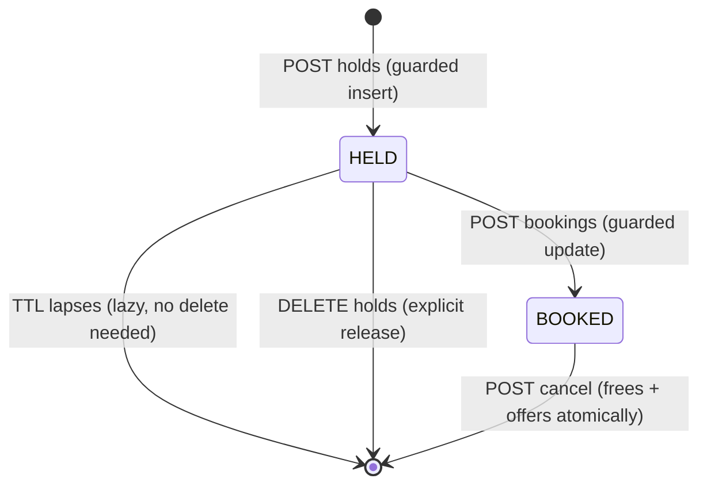
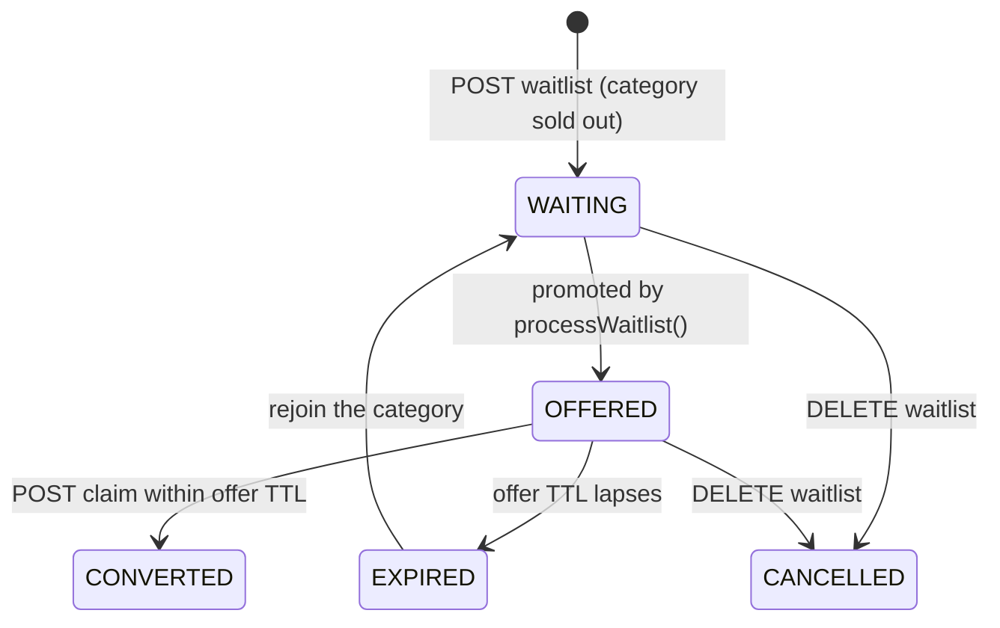
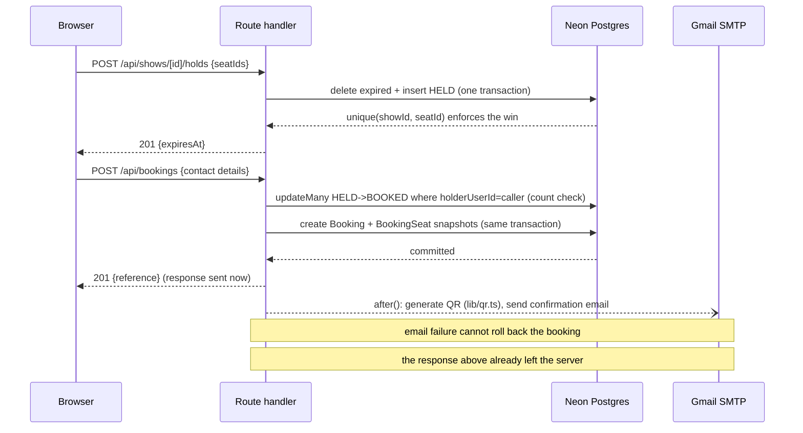
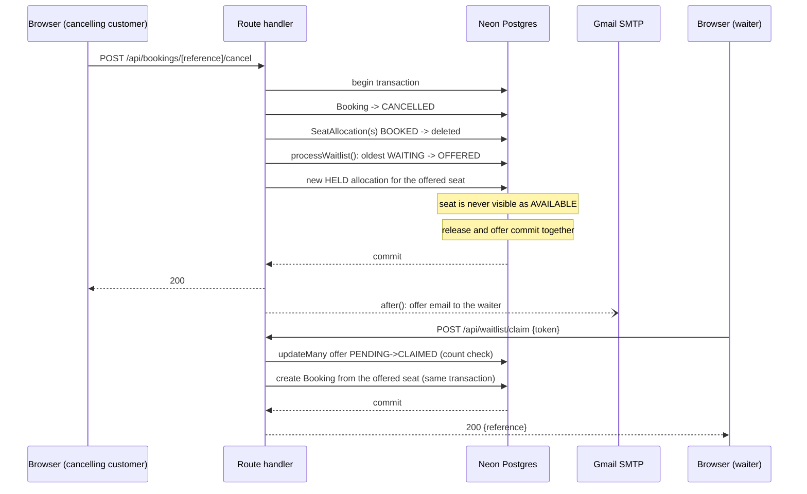
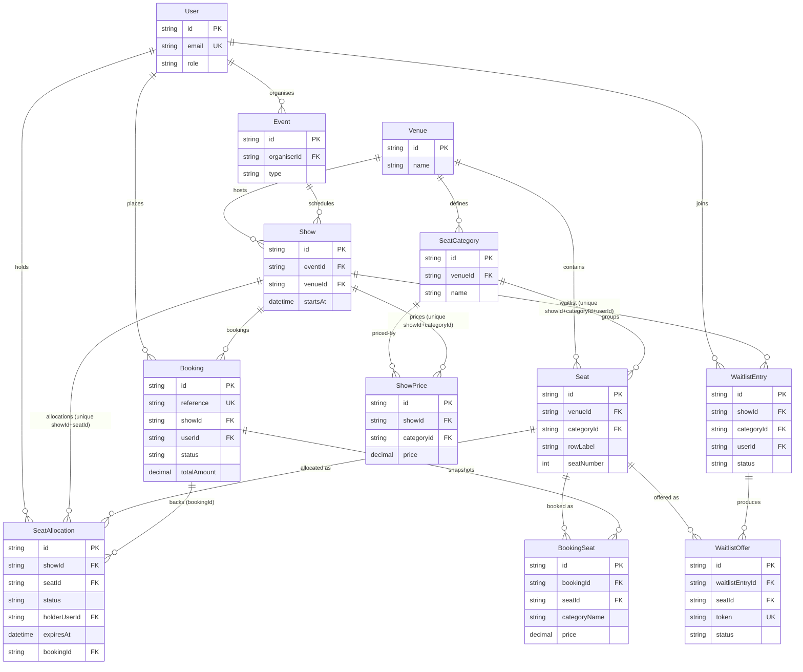
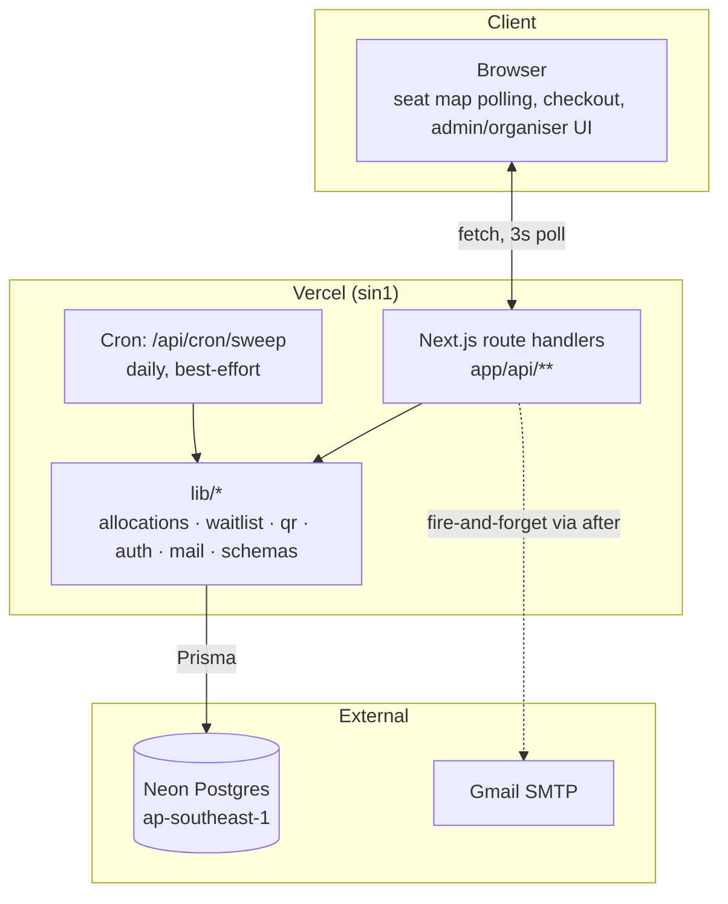

# Architecture

This document explains the shape of the system as a series of decisions traced back to the constraints that forced them, not as a tour of the file tree. For the reasoning behind the concurrency and TTL mechanisms specifically, see [`DESIGN.md`](../DESIGN.md). For the full request/response contract, see [`docs/API.md`](API.md).

## Contents

- [Decisions](#decisions)
- [Where each invariant lives](#where-each-invariant-lives)
- [Request lifecycle: a single seat hold](#request-lifecycle-a-single-seat-hold)
- [State machines](#state-machines)
- [Sequence diagrams](#sequence-diagrams)
- [Entity-relationship diagram](#entity-relationship-diagram)
- [Layer diagram](#layer-diagram)

## Decisions

**Why one Next.js deployment instead of a separate API and SPA.** The assignment is a single graded deliverable with a three-day budget, not a system meant to scale two teams independently. A separate API service would add a second deployment target, a second environment-variable surface, and CORS — all cost, no benefit, when route handlers and pages already share the same process, the same Prisma client, and the same auth cookie. Splitting them would be solving a problem this project doesn't have.

**Why lazy expiry is the TTL guarantee and the cron is best-effort.** Vercel's Hobby plan runs cron at most once a day. A hold that only expired when the cron ran could stay locked for close to 24 hours instead of 10 minutes — that's not a TTL, it's a bug wearing a TTL's name. Making expiry a pure function of `(status, expiresAt, now)`, checked at every read, means the guarantee holds regardless of when — or whether — the cron last ran. The cron's only job is deleting rows nobody needs to read as active anymore, so the table doesn't grow forever.

**Why polling and not websockets.** Vercel functions are stateless and short-lived; there's no long-running process to hold a websocket connection open, and adding one (a separate socket server, or a managed pub/sub service) is infrastructure this assignment doesn't call for. A 3-second poll of a read-only, lazily-computed endpoint is cheap per request and needs nothing running between requests.

**Why `after()` for email.** SMTP round-trips to Gmail are not bounded by anything this app controls, and a customer who just paid should not wait on that round-trip to see a confirmation screen. `after()` runs the send once the response has already been returned, so a slow or failing SMTP call extends nothing the customer is looking at. `scripts/booking-test.ts` scenario 7 proves this directly: pointed at an unreachable `SMTP_HOST`, the booking still returns `201` and the row still exists.

**Why the unique constraint is the concurrency mechanism, not an application-level check.** A read-then-write check ("is this seat free? then claim it") has a gap between the read and the write that two concurrent requests can both pass through — that's the entire concurrency bug this system exists to not have. `@@unique([showId, seatId])` on `SeatAllocation` makes the database itself the arbiter: only one row can exist for a given seat on a given show, full stop, regardless of how many requests race to insert one. The losing request doesn't get a wrong answer slower — it gets a constraint violation, deterministically, every time.

**Why release and offer share one transaction.** If a cancellation committed the seat's release and a *separate* step then offered it to the waitlist, there is a window — however small — where the seat is genuinely free and a browsing customer's next 3-second poll can claim it before the waitlist ever sees it. Creating the waitlist offer's `HELD` allocation inside the same transaction that deletes the booking's allocation means the seat is never visible as `AVAILABLE` at any point a poll could observe it.

**Why revenue reads `BookingSeat` snapshots and not live `ShowPrice`.** `BookingSeat` records the category name and price at the moment of booking. If revenue instead joined against the current `ShowPrice`, an organiser changing a price after the show sold seats would silently rewrite history — every past sale would report today's price, not the price the customer actually paid. `scripts/organiser-test.ts` scenario 5 asserts this explicitly: changing a price after a booking exists does not change that booking's contribution to revenue.

**Why layout edits are refused under confirmed bookings.** A `Seat` row is referenced by `BookingSeat.seatId` and `SeatAllocation.seatId`. Deleting or renumbering seats out from under an existing confirmed booking would leave that booking pointing at a seat that no longer means what it meant when the customer paid for it — the ticket a customer holds has to keep meaning the same physical seat. The venue-layout endpoint checks for confirmed bookings against that venue's shows and returns `409` rather than silently deleting live entitlements.

**Why the QR encodes an HMAC, not just the booking reference.** A QR that just encodes the reference is trivially forgeable — anyone with a QR generator and a guessed or overheard reference produces a valid-looking ticket. The QR instead encodes `<reference>.<hmac>`, an HMAC-SHA256 over the reference keyed by a server-only `QR_SIGNING_SECRET` (`lib/qr.ts`); `GET /api/verify/[payload]` recomputes it with `crypto.timingSafeEqual` before trusting the reference at all, so a forged or tampered payload is rejected before it ever touches the database. A cancelled booking still verifies as structurally valid (correct signature) but reports `status: CANCELLED`, because a gate agent needs to distinguish "this was forged" from "this was real but refunded" — different operational responses.

**Why the cancellation transaction carries an explicit timeout, and why that wasn't the real fix.** Cancelling a large booking does up to `MAX_HOLD_SEATS_PER_REQUEST` sequential waitlist offer-handoffs inside one interactive transaction. Against real network latency to Neon this was first measured at ~5.7 seconds for an 8-seat cancellation — past Prisma's 5-second interactive-transaction default, surfacing as `P2028` in production testing (cleanly rolled back, nothing left half-done). The transaction was given an explicit `timeout: 10000` and the route `maxDuration = 15` as an immediate bound, safe because the work inside is already bounded by the hold endpoint's own seat limit. But that bound was a bandage, not a diagnosis: the actual root cause, found afterward, was a Vercel/Neon region mismatch (functions defaulting to `iad1`, the database running in `ap-southeast-1`). Pinning `vercel.json`'s `regions` to `sin1` cut the same 8-seat cancellation to under a second and the polled `GET /api/shows/[id]/seats` from ~2.2s to ~200-400ms — the 700-800ms once attributed to "fixed per-statement latency" was transpacific round-trip time, paid on every statement, on every endpoint, the whole time. See `docs/ENGINEERING-LOG.md` for the full symptom/root-cause/fix writeup and before/after numbers.

## Where each invariant lives

| Invariant | File |
|---|---|
| A `HELD` row is only "active" if `expiresAt` is in the future; `BOOKED` is always active | `lib/allocations.ts` |
| Waitlist promotion, offer creation, offer expiry-and-cascade — all idempotent, re-entrant | `lib/waitlist.ts` |
| QR payload signing and verification (`<reference>.<hmac>`) | `lib/qr.ts` |
| Session creation, password hashing, `requireRole` guard | `lib/auth.ts` |
| Email sending, `MAIL_DRY_RUN` short-circuit, `after()` scheduling | `lib/mail.ts` |

## Request lifecycle: a single seat hold

A customer clicks an available seat, then "Hold 2 seats," on `/shows/[showId]`.

1. **Browser** — `ShowSeatMapClient` has been polling `GET /api/shows/[showId]/seats` every 3 seconds since the page mounted; the click adds the seat to local `selectedSeatIds` state. No network call yet.
2. **Browser → server** — clicking "Hold" sends `POST /api/shows/[showId]/holds` with `{ seatIds }` and the session cookie.
3. **Route handler** (`app/api/shows/[showId]/holds/route.ts`) — `requireRole(["CUSTOMER"])` checks the cookie; a non-customer or missing session returns `401`/`403` before anything else runs.
4. **Validation** — the body is parsed against the Zod schema in `lib/schemas.ts`; a seat count over `MAX_HOLD_SEATS_PER_REQUEST` or a malformed id list returns `400`.
5. **Guard check** — the handler checks whether this user already holds an active allocation on this show (via `lib/allocations.ts`'s `isActive`); if so, `409` before touching the seats in question.
6. **Transaction** — inside one Prisma transaction: expired rows for the requested seats are deleted (lazy cleanup), then new `HELD` rows are inserted with `expiresAt = now + HOLD_TTL_SECONDS`. The `@@unique([showId, seatId])` index means a losing concurrent request on the same seat fails here with Postgres `23505` / Prisma `P2002`, translated to `409` naming the specific seats lost.
7. **Response** — `201` with the held seats and `expiresAt`.
8. **Database** — Neon Postgres, `ap-southeast-1`; the function runs in Vercel's `sin1` region, so this whole round trip is sub-second rather than paying transpacific latency per statement.
9. **Browser** — the next poll tick (or an immediate `refetchNow()`) picks up the new `HELD` row and renders the countdown.

## State machines

### `SeatAllocation`

A seat allocation is a row, not a status field alone — "absent" below means no row exists for that `(showId, seatId)` pair.

- **`POST holds`** is guarded twice: the caller must not already hold an active allocation on this show, and the insert itself relies on `@@unique([showId, seatId])` to reject a losing concurrent request.
- **TTL lapse** needs no delete at all: every reader treats a `HELD` row with `expiresAt` in the past as absent, so the transition is a read-time fact, not a write.
- **`POST bookings`** is a guarded `updateMany` (`status = HELD`, `holderUserId = caller`, count must equal the seat count) inside a transaction; a mismatch rolls the whole thing back.
- **`POST cancel`** deletes the `BOOKED` row and, in the *same* transaction, offers the seat to the next waiter if one exists (see the `WaitlistEntry` diagram below).

### `WaitlistEntry` and `WaitlistOffer`

An entry's offer is a separate linked row (`WaitlistOffer`, its own `PENDING`/`CLAIMED`/`EXPIRED` status) so a lapsed offer's history isn't lost when the entry moves on.

- **`POST waitlist`** is guarded by `@@unique([showId, categoryId, userId])`, which makes a repeat join idempotent instead of a duplicate row, and by an explicit check that the category is actually sold out right now.
- **`WAITING → OFFERED`** is `processWaitlist()`'s guarded `updateMany` (`status = WAITING`, count must be 1); the offer's `HELD` seat allocation is created in the *same transaction* as whatever freed the seat, so it's never publicly visible as available.
- **`OFFERED → CONVERTED`** is the claim's guarded `updateMany` (`status = PENDING`, count must be 1) with the booking created in that same transaction.
- **`OFFERED → EXPIRED`** is detected re-entrantly by `processWaitlist()` on the next write, never by the read-only seat-map poll.
- **`EXPIRED → WAITING`** resets `createdAt` to now, so a rejoin goes to the back of the FIFO line rather than keeping its old position.

## Sequence diagrams

### Seat hold → checkout → booking → QR → email

### Cancellation → offer creation → email → claim → booking

## Entity-relationship diagram

`SeatAllocation.@@unique([showId, seatId])` is the single most important line in the schema — it's the entire concurrency mechanism described above, enforced by Postgres rather than application code. `ShowPrice.@@unique([showId, categoryId])`, `WaitlistEntry.@@unique([showId, categoryId, userId])`, and `Seat.@@unique([venueId, rowLabel, seatNumber])` play the same role for their respective invariants: one price per category per show, one waitlist slot per customer per category per show, one physical seat per row/number per venue.

## Layer diagram

